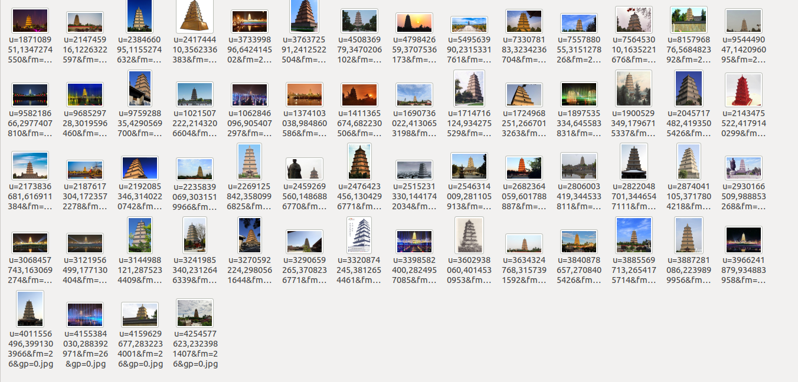

# 基于scrapy的百度图片爬虫

## 使用方法

将项目clone 到本地，进入BaiduImages作为主目录

使用pip安装scrapy

```sh
pip install scrapy
```

在BaiduImages/ 文件夹下修改query_list.txt，文件格式为：
"{queryWordindex},{queryWord},{word},{pages}"，分别表示查询词id，查询词，关键词，查询页数(百度图片当前每页默认30个图片，这个页数*30基本上就是最后会下载的图片数量)
例如: "1,大雁塔,大雁塔,30"

进入爬虫项目文档./BaiduImages/BaiduImages运行爬虫，将输出保存到query.json

``` sh
scrapy crawl -o query.json
```

将图片移动到相应文件夹

```sh
python move_img.py
```

结果如下图:

